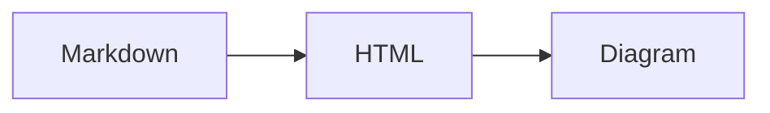
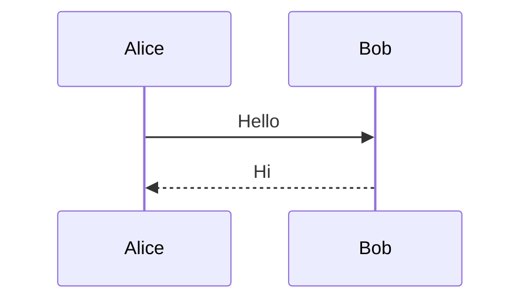
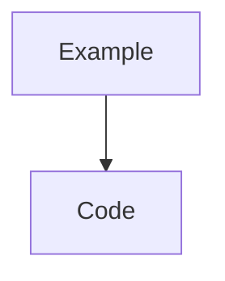

# Mermaid


```mermaid
flowchart LR
    A[Markdown] --> B[HTML]
    B --> C[Diagram]
```


```mermaid
sequenceDiagram
    Alice->>Bob: Hello
    Bob-->>Alice: Hi
```

~~~mermaid
classDiagram
    Document <|-- Markdown
    Document : +render()
~~~

````text

```mermaid
graph TD
    Example --> Code
```
````

```python
print("Ordinary code stays highlighted")
```
